[](https://commerce.coinbase.com/checkout/faf64f90-2e80-46ee-aeba-0fde14cbeb46)
[](https://www.paypal.com/donate?hosted_button_id=GTSXAJQEBZ7XG)

# Spring Security with SAML2 and Okta  
Greetings! In this post, we will be showing you how to build a Spring Boot application that uses Okta as platform for authentication via SAML (Security Assertion Markup Language). Ready to get started?  

## What you’ll need

 - About 40 minutes 
 - A favorite IDE. In this post, we use [Intellij Community](https://www.jetbrains.com/idea/download/index.html) 
 - [JDK 11](http://www.oracle.com/technetwork/java/javase/downloads/index.html) or later. It can be made to work with JDK8, but it will need configuration tweaks. Please check the Spring Boot documentation
  
## Sign Up for an Okta Developer Account  
  
Signing up for an Okta Developer Account is very simple and straight forward. Go to https://developer.okta.com, and fill in the required information.  
  
When you're done, you’ll receive an email requesting you to activate your account and change your temporary password. After completing these steps, you’ll land on your dashboard with some annotations about “apps”.  
  
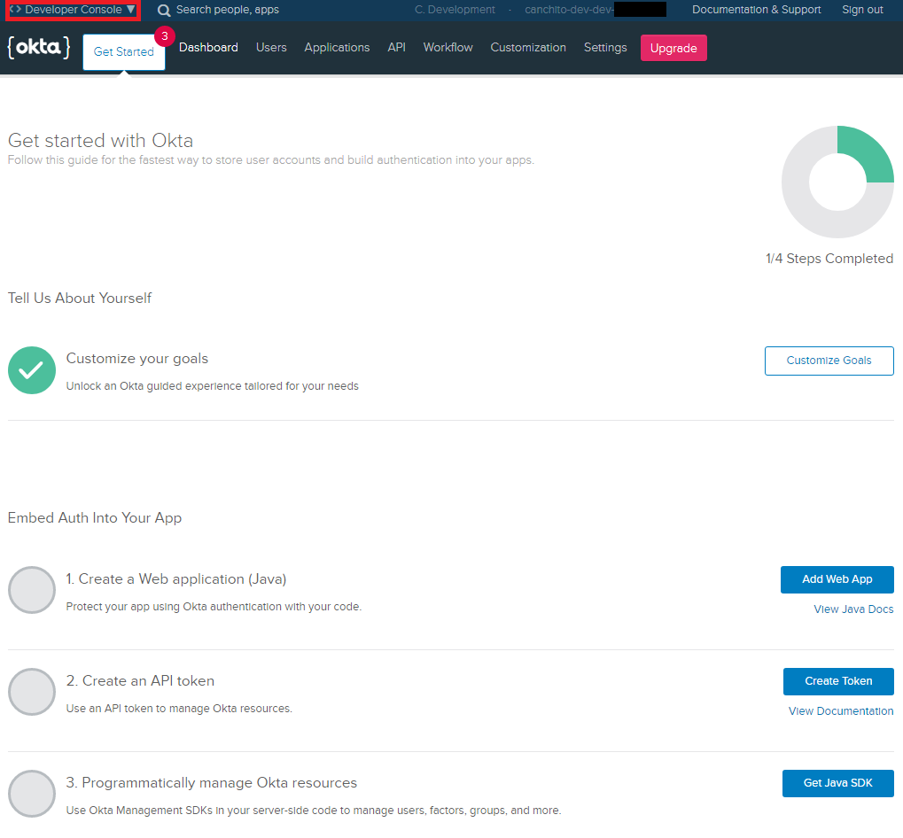  
  
Within the activation mail, you will get your Okta URL. Make sure you take a screenshot or write down, as you’ll need this URL to get back to Okta user interface.

## Create a SAML Application on Okta
After activating your account, log in to it. If you just created an account, you’ll see a screen similar to the one above.

The first thing we are going to do, is change to the Classic UI. Click on **< > Developer Console** in the top-left corner and switch to the Classic UI. If you see a screen like the following, you’re good to go!

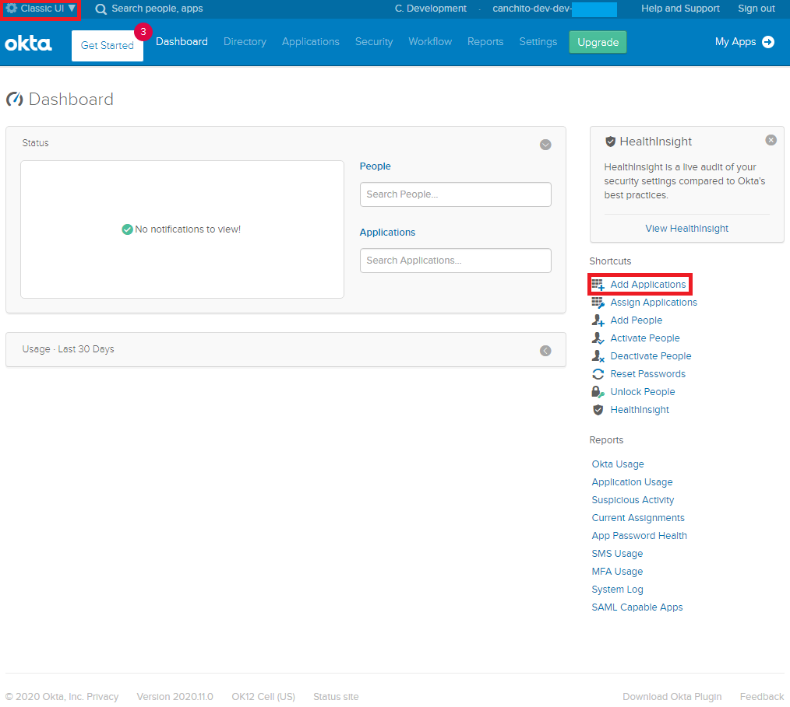

Click **Add Applications** in the top right to continue. This will bring you to a screen with a list of applications. Here, click on **Create New App** green button on the left.

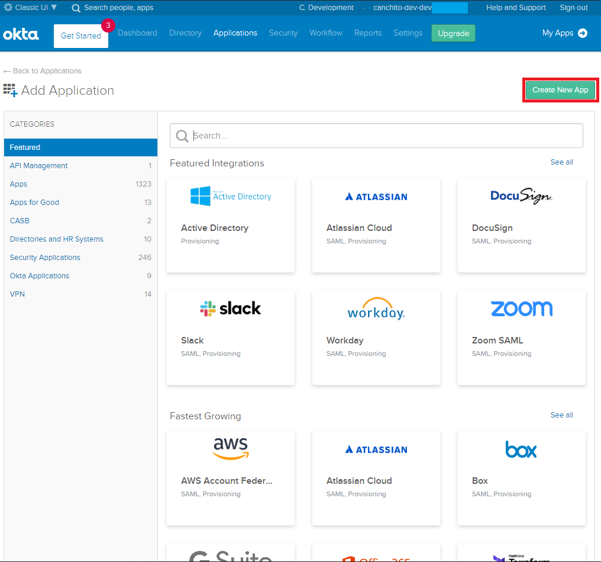

After clicking it, a popup window with the title *"Create a New Application Integration"* will be shown. Select ***Web*** as platform and ***SAML 2.0*** as sign on method. Just as shown in the image below.

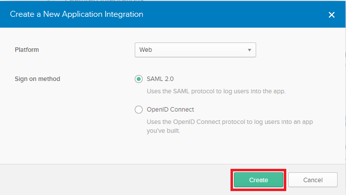

Once you reach the next screen, you will be prompted for an application name. In this case, we have used "spring-saml". You can leave everything else as it is. Click on **Next** green button to continue.

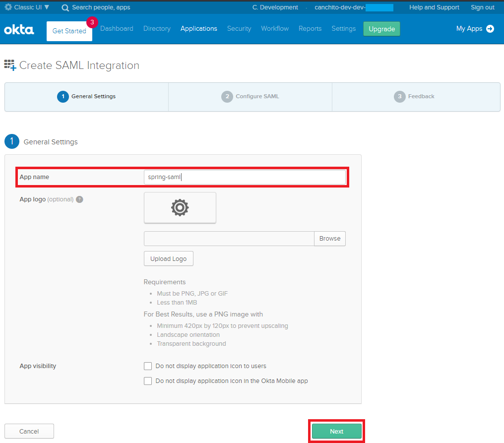

Now you have reached the second step, configuring SAML. Enter the following values:

- Single sign on URL:  `https://localhost:8443/spring-saml/login/saml2/sso/okta`
- Audience URI (SP Entity Id):  `https://localhost:8443/spring-saml/saml2/service-provider-metadata/okta`
- Use this for Recipient URL and Destination URL: Make sure it is checked.

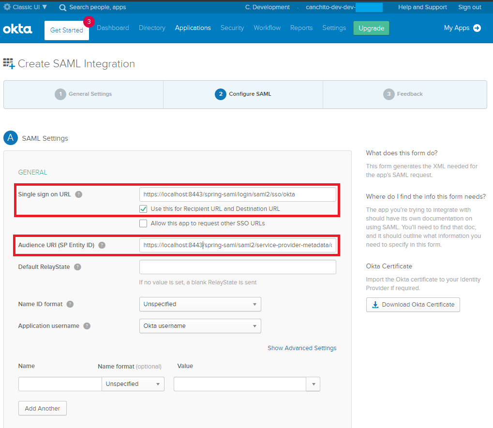

Scroll to the bottom of the form and click **Next**. This will bring you to the last step, feedback. Choose ***“I’m an Okta customer adding an internal app”*** and check ***"This is an internal app that we have created"*** App type.

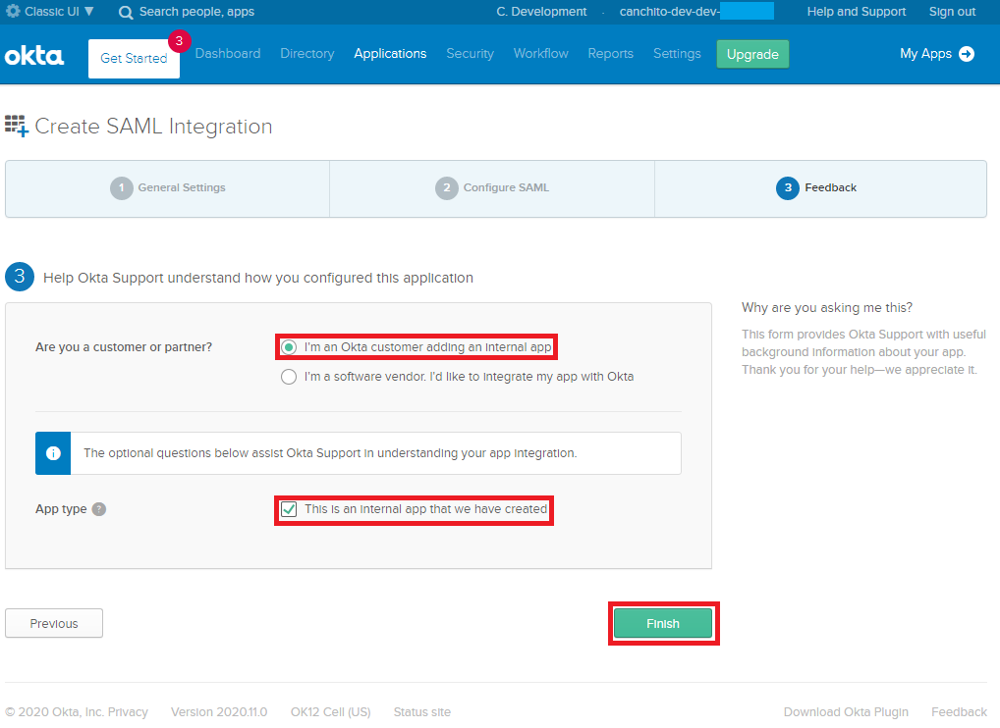

Click the **Finish** button to continue. This will bring you to the application’s “Sign On” tab which has a section with a link to your applications metadata in a yellow box. Click on **View Setup Instructions**. A new tab will open. Do not close it, as you will need this information to configure your Spring Boot application.

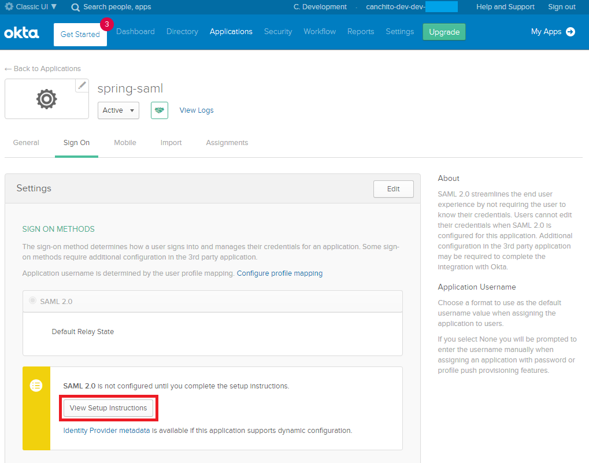

The final setup step you’ll need to do, is assigning people to the application. Click on the **Assignments** tab and the **Assign** > **Assign to People** button. 

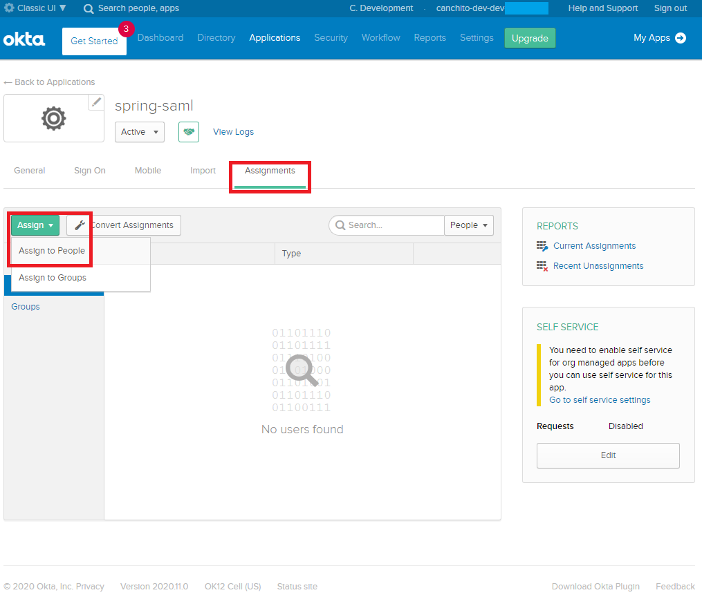

You’ll see a list of people with your account in it. Click the **Assign** button, accept the default username (your email), and click the **Done** button.

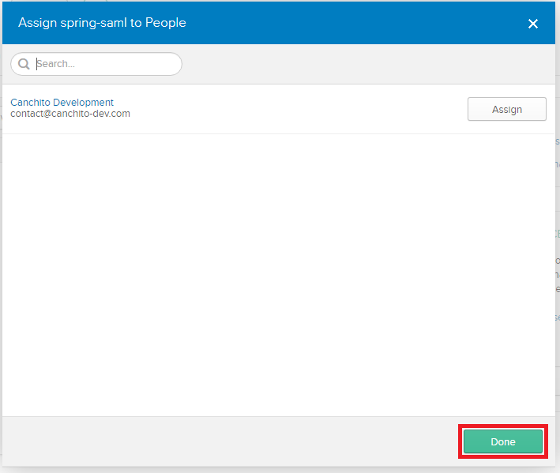

## Create a Spring Boot Application with SAML Authentication
For all Spring Boot applications, it is always a good idea to start with the [Spring Initializr](https://start.spring.io/). The Initializr is an excellent option for pulling in all the dependencies you need for an application and does a lot of the setup for you. This example needs only the Spring Web, Spring Security,  Spring Boot DevTools and Thymeleaf dependencies.

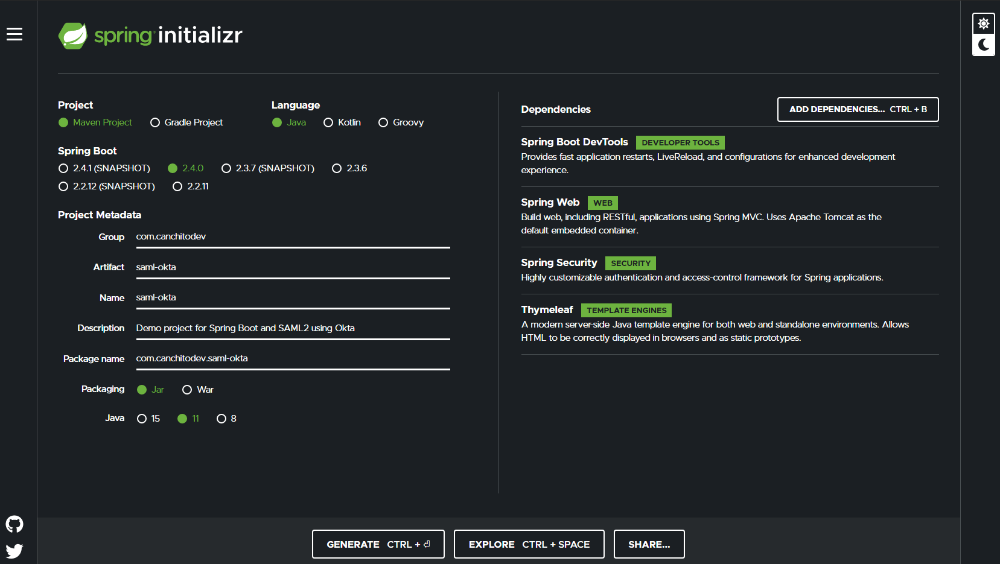

Click **Generate Project**, download the generated ZIP file and open it in your favorite editor.

SAML 2.0 service provider support resides in `spring-security-saml2-service-provider`. It builds off of the OpenSAML library. By default, this SAML 2.0 dependency is not included. So the first thing we need to do, is include it.

```xml
<dependency>  
	<groupId>org.springframework.security</groupId>  
	<artifactId>spring-security-saml2-service-provider</artifactId>  
	<version>5.4.1</version>  
</dependency>
```

SAML authentication on Spring Security, can be configured to work with HTTP, but you will need to configure a reverse proxy server such as NGINX. To avoid this, we will enable SSL and HTTPS support on our Spring Boot application, by adding the following properties into our `application.yml`:

```
server:  
  port: 8443  
  servlet:  
    context-path: /spring-saml  
  ssl:  
    enabled: true  
    key-alias: spring  
    key-store: "classpath:saml/keystore.jks"  
  key-store-password: secret
```
Notice that we have created a `keystore.jks` file. From a terminal window, navigate to the `src/main/resources` directory of your app and create a `saml` directory. Navigate into the directory and run the following command. Use “secret” when prompted for a keystore password.

```cmd
keytool -genkey -v -keystore keystore.jks -alias spring -keyalg RSA -keysize 2048 -validity 10000
```

The values for the rest of the questions don’t matter since you’re not generating a real certificate. However, you will need to answer “yes” to the following question.

```
Is CN=Unknown, OU=Unknown, O=Unknown, L=Unknown, ST=Unknown, C=Unknown correct?
  [no]:
```

Until now, we have only configure our application to use HTTPS. It is time to add the required configuration so that we can use Okta for the user authentication. Add the following properties into the `application.yml` file:

```
spring:  
  security:  
    saml2:  
      relyingparty:  
        registration:  
          okta:  
            identityprovider:  
              entity-id: YOUR-ENTITY-ID-URL
              verification.credentials:  
                - certificate-location: "classpath:saml/okta.cert"  
			  singlesignon.url: YOUR-SSO-URL  
              singlesignon.sign-request: false
```

Notice that there are some information that you need from Okta. Do not worry, it is very easy to get. Remember the **View Setup Instructions** that opened a few steps back? Go back to it, and collect the information from there. Follow the instructions in the below image:

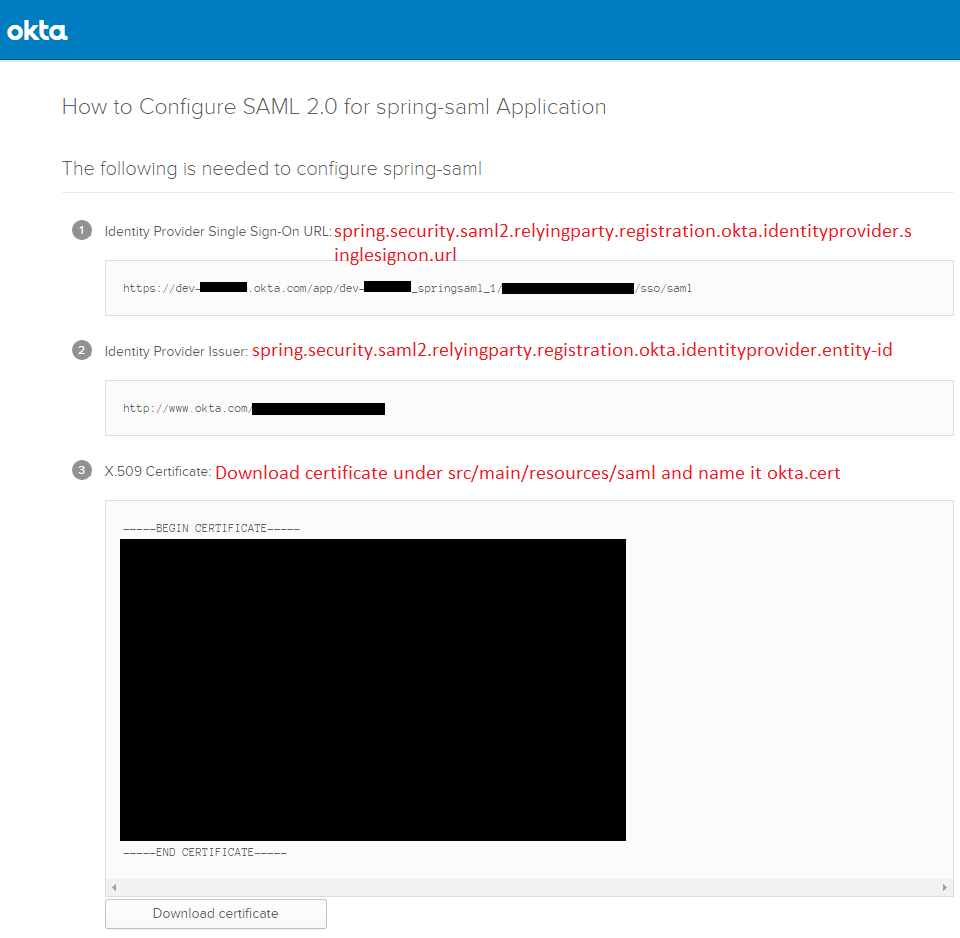

Let's now create a `SecurityConfiguration.java` file in the `com.canchitodev.samldemo.configuration` package.

```java
package com.canchitodev.samldemo.configuration;  
  
import org.opensaml.saml.saml2.core.Assertion;  
import org.springframework.context.annotation.Bean;  
import org.springframework.context.annotation.Configuration;  
import org.springframework.security.authentication.ProviderManager;  
import org.springframework.security.config.annotation.method.configuration.EnableGlobalMethodSecurity;  
import org.springframework.security.config.annotation.web.builders.HttpSecurity;  
import org.springframework.security.config.annotation.web.configuration.EnableWebSecurity;  
import org.springframework.security.config.annotation.web.configuration.WebSecurityConfigurerAdapter;  
import org.springframework.security.core.userdetails.User;  
import org.springframework.security.core.userdetails.UserDetails;  
import org.springframework.security.core.userdetails.UserDetailsService;  
import org.springframework.security.provisioning.InMemoryUserDetailsManager;  
import org.springframework.security.saml2.provider.service.authentication.OpenSamlAuthenticationProvider;  
import org.springframework.security.saml2.provider.service.authentication.Saml2Authentication;  
  
@EnableWebSecurity  
@Configuration  
@EnableGlobalMethodSecurity(securedEnabled = true)  
public class SecurityConfiguration extends WebSecurityConfigurerAdapter {
	
	@Bean  
	public UserDetailsService inMemoryUserDetailsManager() {  
		// The builder will ensure the passwords are encoded before saving in memory  
		User.UserBuilder users = User.withDefaultPasswordEncoder();  
		UserDetails user = users  
			.username("YOUR_OKTA_USER")  
			.password("YOUR_OKTA_USER_PWD")  
			.roles("USER", "ADMIN")  
			.build();  
		return new InMemoryUserDetailsManager(user);  
	}  

	@Override  
	protected void configure(HttpSecurity http) throws Exception {  
		OpenSamlAuthenticationProvider authenticationProvider = new OpenSamlAuthenticationProvider();  
		authenticationProvider.setResponseAuthenticationConverter(responseToken -> {  
			Saml2Authentication authentication = OpenSamlAuthenticationProvider  
				.createDefaultResponseAuthenticationConverter()  
				.convert(responseToken);  
			Assertion assertion = responseToken.getResponse().getAssertions().get(0);  
			String username = assertion.getSubject().getNameID().getValue();  
			UserDetails userDetails = inMemoryUserDetailsManager().loadUserByUsername(username);  
			authentication.setDetails(userDetails);  
			return authentication;  
		});  

		http  
			.authorizeRequests(authorize -> authorize  
				.anyRequest().authenticated()  
			)  
			.saml2Login(saml2 -> saml2  
				.authenticationManager(new ProviderManager(authenticationProvider))  
			);  
		}  
}
```

Notice that we have created an `InMemoryUserDetailsManager`, which implements `UserDetailsService` to provide support for username/password based authentication that is retrieved in memory. 

This is done, because we want to show you, what you could do, if you needed to implement a custom authentication manager that includes user details from a "legacy" `UserDetailsService`.  You would want to use this "legacy" service, in situations in which you just want to authenticate the user, but use the permissions and privileges specified by the legacy system.

If you do not need this, or you want to configure the permissions and privileges in Okta, change the `configure` method to the following:

```java
protected void configure(HttpSecurity http) {
	http
		.authorizeRequests(authorize -> authorize
				.anyRequest().authenticated()
		)
		.saml2Login(withDefaults());
}
```

Great! Now, we will be creating a controller and use it to set the default view to `index`.  Add a class file under `com.canchitodev.samldemo` and called it `IndexController.java`.  The file should look like this:

```java
package com.canchitodev.samldemo.controller;  
  
import org.springframework.security.core.annotation.AuthenticationPrincipal;  
import org.springframework.security.saml2.provider.service.authentication.Saml2AuthenticatedPrincipal;  
import org.springframework.stereotype.Controller;  
import org.springframework.ui.Model;  
import org.springframework.web.bind.annotation.RequestMapping;  
  
@Controller  
public class IndexController {

	@RequestMapping("/")  
    public String index(Model model, @AuthenticationPrincipal Saml2AuthenticatedPrincipal principal) {
	    String emailAddress = principal.getFirstAttribute("emailAddress");
	    model.addAttribute("emailAddress", emailAddress);
	    model.addAttribute("userAttributes", principal.getAttributes());
	    return "index";
	}  
}
```

Since you chose Thymeleaf when creating your application, you can create a `src/main/resources/templates/index.html` and it will automatically be rendered after you sign-in. Create this file and populate it with the following HTML.

```html
<!doctype html>  
<html xmlns="http://www.w3.org/1999/xhtml" xmlns:th="https://www.thymeleaf.org" xmlns:sec="https://www.thymeleaf.org/thymeleaf-extras-springsecurity5">  
<head>
	<title>Spring Security - SAML 2.0 Login</title>
	<meta charset="utf-8" />
	<style>
		span, dt {
			font-weight: bold;  
        }  
    </style>  
</head>  
<body>
	<div>
		<form th:action="@{/logout}" method="post">
			<input type="submit" value="Logout" />
		</form>
	</div>  
	<h1>SAML 2.0 Login with Spring Security</h1>  
	<p>You are successfully logged in as <span sec:authentication="name"></span></p>  
</body>  
</html>
```

## Time to Run the App and Login with Okta
Start the app using your IDE or `mvn spring-boot:run` and afterwards, user your favorite browser and navigate to `https://localhost:8443/spring-saml`. It is likely that you will see a privacy error.

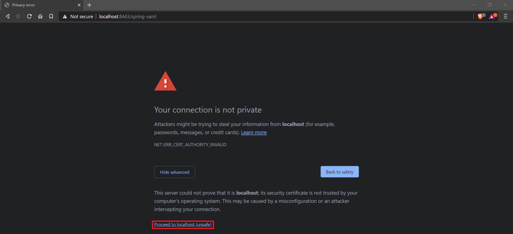

Click the **ADVANCED** link at the bottom. Then click the **Proceed to localhost (unsafe)** link.

Next, you’ll be redirected to Okta to sign in and redirected back to your app. If you’re already logged in, you won’t see anything from Okta. If you sign out from Okta, you’ll see a login screen such as the one below.

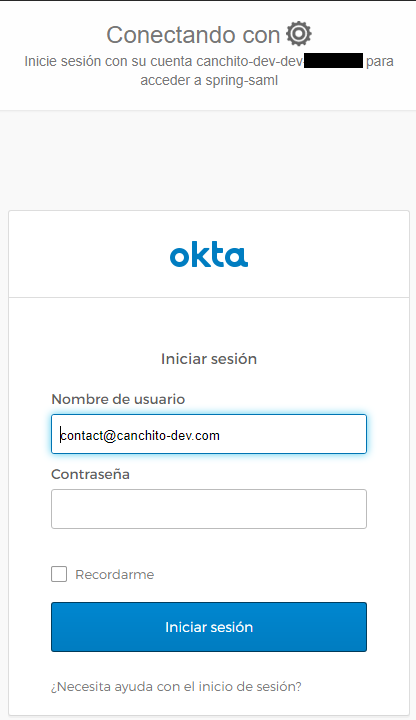

After you’ve logged in, you should see a screen like the one below.

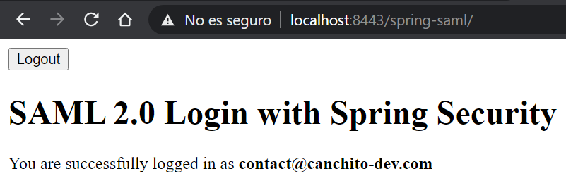

## Contribute Code
If you would like to become an active contributor to this project please follow these simple steps:

 1. Fork it 
 2. Create your feature branch 
 3. Commit your changes 
 4. Push to the branch
 5. Create new Pull Request

The full implementation of this article can be found in the [GitHub](https://github.com/canchito-dev/spring-security-with-saml2-and-okta)  project – this is a **Maven**-based project, so it should be easy to import and run as it is.

## Summary
In this article, we showed how to create a Spring Boot application that integrates with Okta as a SAML authentication provider. We hope that, even though this was a very basic introduction, you understood how to use and configure this tool. 

Please feel free to contact us. We will gladly response to any doubt or question you might have.

## License
The MIT License (MIT)

Copyright (c) 2020, canchito-dev

Permission is hereby granted, free of charge, to any person obtaining a copy of this software and associated documentation files (the “Software”), to deal in the Software without restriction, including without limitation the rights to use, copy, modify, merge, publish, distribute, sublicense, and/or sell copies of the Software, and to permit persons to whom the Software is furnished to do so, subject to the following conditions:

The above copyright notice and this permission notice shall be included in all copies or substantial portions of the Software.

THE SOFTWARE IS PROVIDED “AS IS”, WITHOUT WARRANTY OF ANY KIND, EXPRESS OR IMPLIED, INCLUDING BUT NOT LIMITED TO THE WARRANTIES OF MERCHANTABILITY, FITNESS FOR A PARTICULAR PURPOSE AND NONINFRINGEMENT. IN NO EVENT SHALL THE AUTHORS OR COPYRIGHT HOLDERS BE LIABLE FOR ANY CLAIM, DAMAGES OR OTHER LIABILITY, WHETHER IN AN ACTION OF CONTRACT, TORT OR OTHERWISE, ARISING FROM, OUT OF OR IN CONNECTION WITH THE SOFTWARE OR THE USE OR OTHER DEALINGS IN THE SOFTWARE.